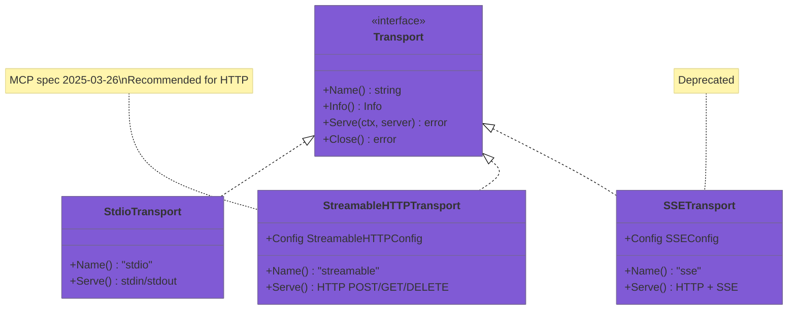
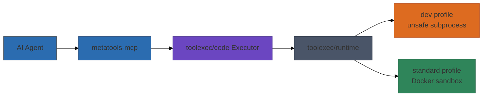

# Architecture

`metatools-mcp` composes the core libraries and exposes a small MCP tool surface.

## Transport layer

The transport layer abstracts how clients connect to the MCP server. All transports
implement the `Transport` interface, enabling protocol flexibility without changing
server logic.

| Transport | Protocol | Session | Best For |
|-----------|----------|---------|----------|
| `stdio` | stdin/stdout JSON-RPC | Implicit | Claude Desktop, local CLI |
| `streamable` | HTTP POST/GET/DELETE | Mcp-Session-Id header | Web apps, remote clients |
| `sse` | HTTP + Server-Sent Events | Cookie-based | Legacy (deprecated) |

## Component wiring

## Runtime layer (execute_code)

When built with the `toolruntime` tag, `execute_code` is backed by a runtime
that selects between an unsafe dev backend and a Docker-backed standard
backend. Docker is opt-in via `METATOOLS_RUNTIME_PROFILE=standard`.

Standard isolation can also be provided by the WASM backend when enabled
(`METATOOLS_WASM_ENABLED=true`, `METATOOLS_RUNTIME_BACKEND=wasm`). If Docker
is unavailable and WASM is enabled, the server falls back to WASM for the
standard profile.

## Progressive disclosure flow

## MCP tool mapping

