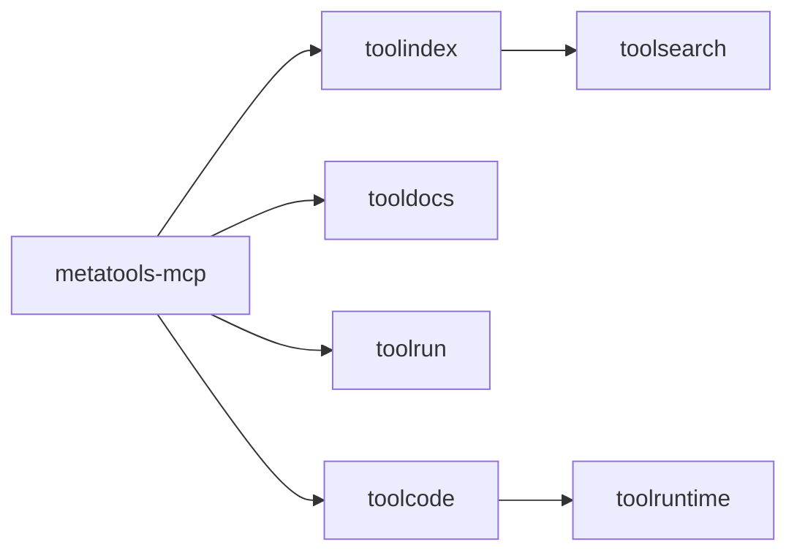
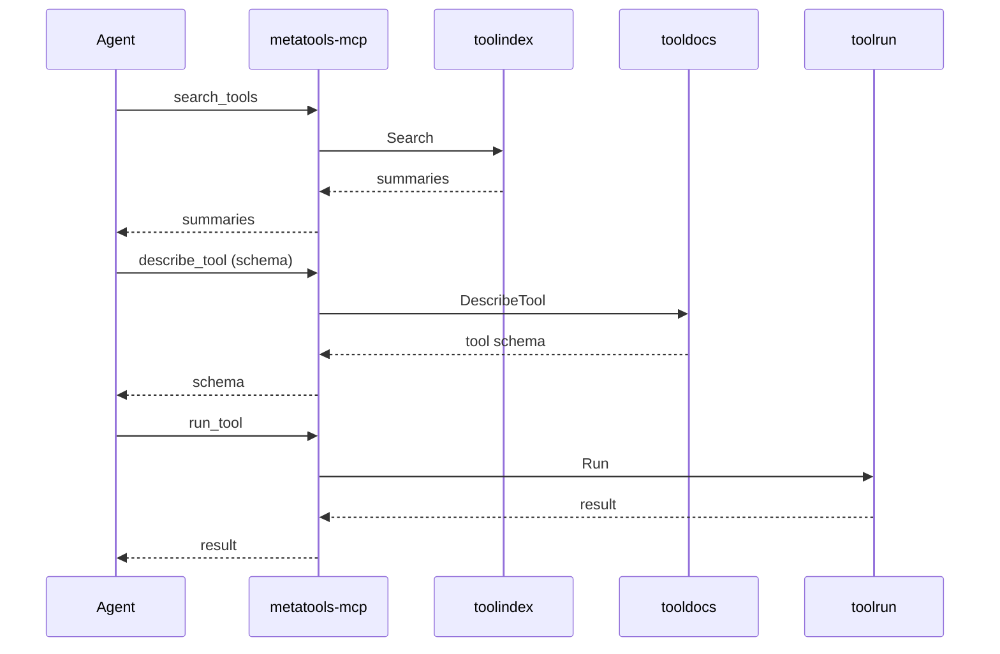
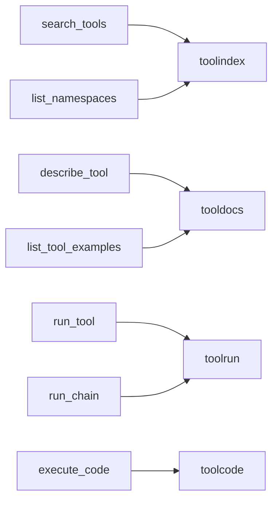

# Architecture

`metatools-mcp` composes the core libraries and exposes a small MCP tool surface.

## Component wiring

```mermaid
flowchart LR
  A[metatools-mcp] --> B[toolindex]
  A --> C[tooldocs]
  A --> D[toolrun]
  A --> E[toolcode]
  E --> F[toolruntime]

  B --> G[toolsearch]
```

## Progressive disclosure flow

```mermaid
sequenceDiagram
  participant Agent
  participant MCP as metatools-mcp
  participant Index as toolindex
  participant Docs as tooldocs
  participant Run as toolrun

  Agent->>MCP: search_tools
  MCP->>Index: Search
  Index-->>MCP: summaries
  MCP-->>Agent: summaries

  Agent->>MCP: describe_tool (schema)
  MCP->>Docs: DescribeTool
  Docs-->>MCP: tool schema
  MCP-->>Agent: schema

  Agent->>MCP: run_tool
  MCP->>Run: Run
  Run-->>MCP: result
  MCP-->>Agent: result
```

## MCP tool mapping

```mermaid
flowchart LR
  search_tools --> toolindex
  list_namespaces --> toolindex
  describe_tool --> tooldocs
  list_tool_examples --> tooldocs
  run_tool --> toolrun
  run_chain --> toolrun
  execute_code --> toolcode
```
