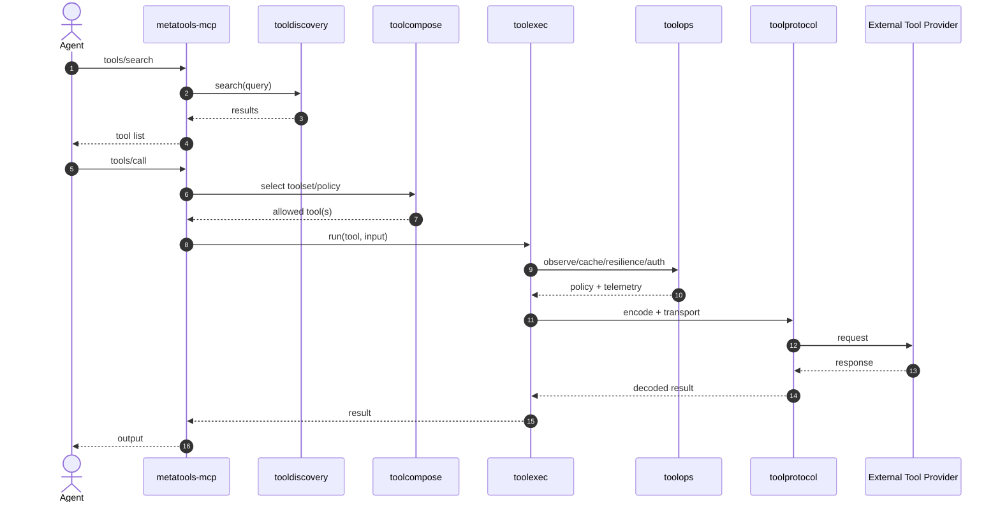

# Data Flow

## Overview

End-to-end flow for discovery and execution requests across the stack.

## Diagram

```mermaid
sequenceDiagram
    autonumber
    actor Agent
    participant MCP as metatools-mcp
    participant Discovery as tooldiscovery
    participant Compose as toolcompose
    participant Exec as toolexec
    participant Ops as toolops
    participant Proto as toolprotocol
    participant Provider as External Tool Provider

    Agent->>MCP: tools/search
    MCP->>Discovery: search(query)
    Discovery-->>MCP: results
    MCP-->>Agent: tool list

    Agent->>MCP: tools/call
    MCP->>Compose: select toolset/policy
    Compose-->>MCP: allowed tool(s)
    MCP->>Exec: run(tool, input)
    Exec->>Ops: observe/cache/resilience/auth
    Ops-->>Exec: policy + telemetry
    Exec->>Proto: encode + transport
    Proto->>Provider: request
    Provider-->>Proto: response
    Proto-->>Exec: decoded result
    Exec-->>MCP: result
    MCP-->>Agent: output
```
