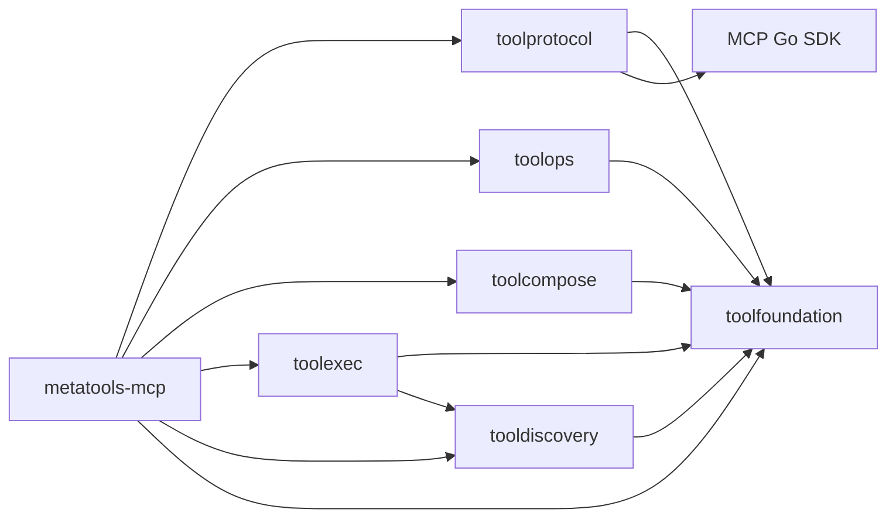

# Dependency Graph

## Overview

Inter-repo dependencies (conceptual view). Higher layers depend on lower layers only.

## Diagram

```mermaid
graph LR
    mcp["MCP Go SDK"]

    toolfoundation["toolfoundation"]
    tooldiscovery["tooldiscovery"]
    toolexec["toolexec"]
    toolcompose["toolcompose"]
    toolops["toolops"]
    toolprotocol["toolprotocol"]
    metatools["metatools-mcp"]

    tooldiscovery --> toolfoundation
    toolexec --> toolfoundation
    toolexec --> tooldiscovery
    toolcompose --> toolfoundation
    toolops --> toolfoundation
    toolprotocol --> toolfoundation

    toolprotocol --> mcp

    metatools --> toolprotocol
    metatools --> toolops
    metatools --> toolcompose
    metatools --> toolexec
    metatools --> tooldiscovery
    metatools --> toolfoundation
```
