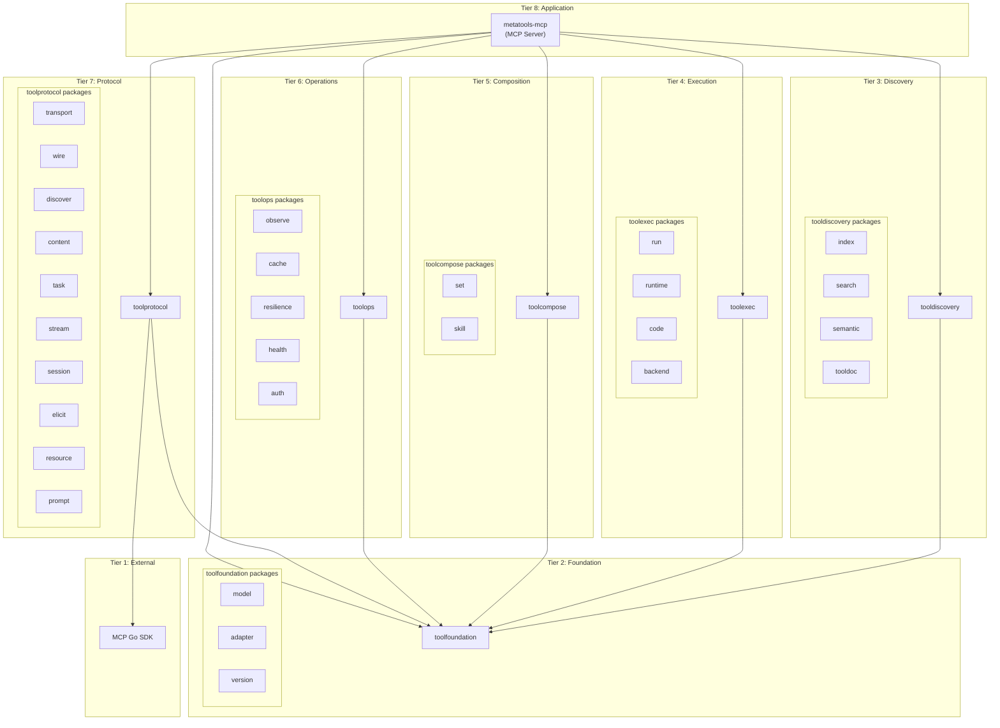

# Layer Architecture

## Overview

The ApertureStack ecosystem is organized into layered tiers. Each higher tier depends on lower tiers only.

## Diagram

```mermaid
graph TB
    subgraph "Tier 8: Application"
        metatools["metatools-mcp\n(MCP Server)"]
    end

    subgraph "Tier 7: Protocol"
        toolprotocol["toolprotocol"]
        subgraph "toolprotocol packages"
            transport["transport"]
            wire["wire"]
            discover["discover"]
            content["content"]
            task["task"]
            stream["stream"]
            session["session"]
            elicit["elicit"]
            resource["resource"]
            prompt["prompt"]
        end
    end

    subgraph "Tier 6: Operations"
        toolops["toolops"]
        subgraph "toolops packages"
            observe["observe"]
            cache["cache"]
            resilience["resilience"]
            health["health"]
            auth["auth"]
        end
    end

    subgraph "Tier 5: Composition"
        toolcompose["toolcompose"]
        subgraph "toolcompose packages"
            set["set"]
            skill["skill"]
        end
    end

    subgraph "Tier 4: Execution"
        toolexec["toolexec"]
        subgraph "toolexec packages"
            run["run"]
            runtime["runtime"]
            code["code"]
            backend["backend"]
        end
    end

    subgraph "Tier 3: Discovery"
        tooldiscovery["tooldiscovery"]
        subgraph "tooldiscovery packages"
            index["index"]
            search["search"]
            semantic["semantic"]
            docs["tooldoc"]
        end
    end

    subgraph "Tier 2: Foundation"
        toolfoundation["toolfoundation"]
        subgraph "toolfoundation packages"
            model["model"]
            adapter["adapter"]
            version["version"]
        end
    end

    subgraph "Tier 1: External"
        mcp["MCP Go SDK"]
    end

    metatools --> toolprotocol
    metatools --> toolops
    metatools --> toolcompose
    metatools --> toolexec
    metatools --> tooldiscovery
    metatools --> toolfoundation

    toolprotocol --> toolfoundation
    toolops --> toolfoundation
    toolcompose --> toolfoundation
    toolexec --> toolfoundation
    tooldiscovery --> toolfoundation

    toolprotocol --> mcp
```
