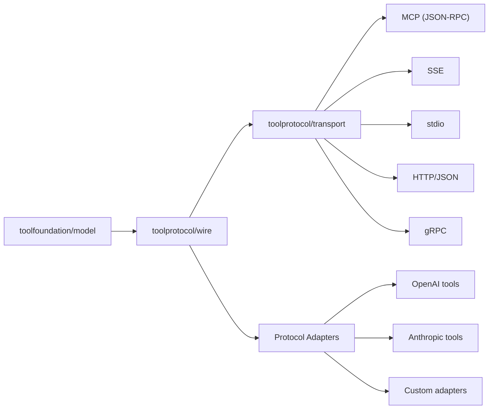

# Protocol Adapters

## Overview

`toolprotocol` provides transport and wire adapters to support multiple client/server protocols.

## Diagram

```mermaid
graph LR
    model["toolfoundation/model"] --> wire["toolprotocol/wire"]
    wire --> transport["toolprotocol/transport"]

    transport --> mcp["MCP (JSON-RPC)"]
    transport --> sse["SSE"]
    transport --> stdio["stdio"]
    transport --> http["HTTP/JSON"]
    transport --> grpc["gRPC"]

    wire --> adapters["Protocol Adapters"]
    adapters --> openai["OpenAI tools"]
    adapters --> anthropic["Anthropic tools"]
    adapters --> custom["Custom adapters"]
```
