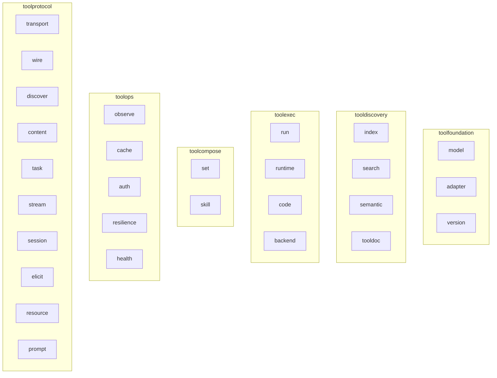

# Repository Map

## Overview

This map shows the six consolidated repositories and the packages they contain.

## Diagram

```mermaid
graph TB
    subgraph toolfoundation
        tf_model["model"]
        tf_adapter["adapter"]
        tf_version["version"]
    end

    subgraph tooldiscovery
        td_index["index"]
        td_search["search"]
        td_semantic["semantic"]
        td_doc["tooldoc"]
    end

    subgraph toolexec
        te_run["run"]
        te_runtime["runtime"]
        te_code["code"]
        te_backend["backend"]
    end

    subgraph toolcompose
        tc_set["set"]
        tc_skill["skill"]
    end

    subgraph toolops
        to_observe["observe"]
        to_cache["cache"]
        to_auth["auth"]
        to_resilience["resilience"]
        to_health["health"]
    end

    subgraph toolprotocol
        tp_transport["transport"]
        tp_wire["wire"]
        tp_discover["discover"]
        tp_content["content"]
        tp_task["task"]
        tp_stream["stream"]
        tp_session["session"]
        tp_elicit["elicit"]
        tp_resource["resource"]
        tp_prompt["prompt"]
    end
```
