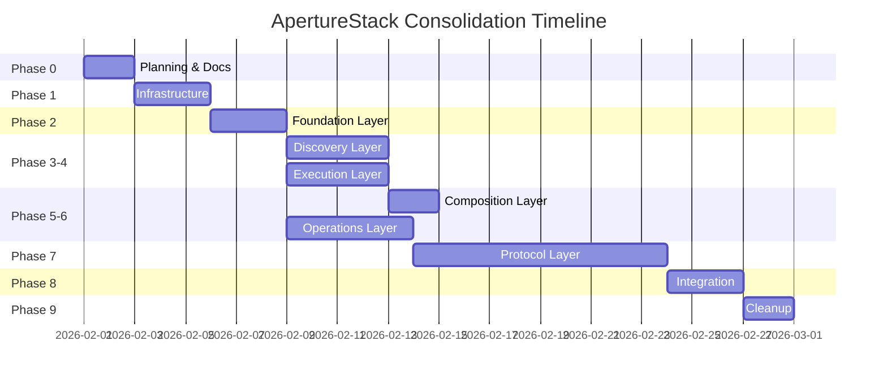

# ApertureStack Consolidation Master Plan

**Date:** 2026-01-30
**Version:** 1.0
**Status:** Planning

---

## Executive Summary

This document outlines the complete consolidation of the ApertureStack ecosystem from **15 standalone repositories** into **6 consolidated repositories** plus metatools-mcp. This is a breaking change with no backward compatibility requirements.

### Current State

```
ApertureStack/
├── toolmodel/          # Standalone
├── tooladapter/        # Standalone
├── toolindex/          # Standalone
├── toolsearch/         # Standalone
├── toolsemantic/       # Standalone (partial)
├── tooldocs/           # Standalone
├── toolrun/            # Standalone
├── toolruntime/        # Standalone
├── toolcode/           # Standalone
├── toolset/            # Standalone
├── toolskill/          # Standalone (partial)
├── toolobserve/        # Standalone
├── toolcache/          # Standalone
├── ai-tools-stack/     # Coordination repo
└── metatools-mcp/      # MCP server
```

### Target State

```
ApertureStack/
├── toolfoundation/     # model + adapter + version
├── tooldiscovery/      # index + search + semantic + docs
├── toolexec/           # run + runtime + code + backend
├── toolcompose/        # set + skill
├── toolops/            # observe + cache + resilience + health + auth
├── toolprotocol/       # transport + wire + discover + content + task + stream + session + elicit + resource + prompt
├── ai-tools-stack/     # Coordination repo (updated)
└── metatools-mcp/      # MCP server (updated)
```

---

## Phase Overview

| Phase | Name | PRDs | Effort | Dependencies |
|-------|------|------|--------|--------------|
| **0** | Planning & Documentation | 100-102 | 2 days | None |
| **1** | Infrastructure Setup | 110-113 | 3 days | Phase 0 |
| **2** | Foundation Layer | 120-122 | 3 days | Phase 1 |
| **3** | Discovery Layer | 130-133 | 4 days | Phase 2 |
| **4** | Execution Layer | 140-143 | 4 days | Phase 2 |
| **5** | Composition Layer | 150-151 | 2 days | Phase 3, 4 |
| **6** | Operations Layer | 160-164 | 5 days | Phase 2 |
| **7** | Protocol Layer | 170-179 | 10 days | Phase 2, 4, 6 |
| **8** | Integration | 180-182 | 3 days | Phase 2-7 |
| **9** | Cleanup | 190-192 | 2 days | Phase 8 |

**Total Estimated: 38 days (~8 weeks)**

---

## PRD Index

### Phase 0: Planning & Documentation

| PRD | Title | Description |
|-----|-------|-------------|
| PRD-100 | Master Consolidation Plan | This document |
| PRD-101 | Architecture Diagrams | D2/Mermaid diagrams for all layers |
| PRD-102 | Schema Definitions | JSON Schema for all data types |

### Phase 1: Infrastructure Setup

| PRD | Title | Description |
|-----|-------|-------------|
| PRD-110 | Repository Creation | Create 6 new repos with structure |
| PRD-111 | CI/CD Templates | Reusable workflow templates |
| PRD-112 | GitHub Org Config | Secrets, branch protection, teams |
| PRD-113 | Release Automation | Release-please config for monorepos |

### Phase 2: Foundation Layer (toolfoundation)

| PRD | Title | Description |
|-----|-------|-------------|
| PRD-120 | Migrate toolmodel | Move to toolfoundation/model |
| PRD-121 | Migrate tooladapter | Move to toolfoundation/adapter |
| PRD-122 | Create toolversion | New: toolfoundation/version |

### Phase 3: Discovery Layer (tooldiscovery)

| PRD | Title | Description |
|-----|-------|-------------|
| PRD-130 | Migrate toolindex | Move to tooldiscovery/index |
| PRD-131 | Migrate toolsearch | Move to tooldiscovery/search |
| PRD-132 | Migrate toolsemantic | Move to tooldiscovery/semantic |
| PRD-133 | Migrate tooldocs | Move to tooldiscovery/docs |

### Phase 4: Execution Layer (toolexec)

| PRD | Title | Description |
|-----|-------|-------------|
| PRD-140 | Migrate toolrun | Move to toolexec/run |
| PRD-141 | Migrate toolruntime | Move to toolexec/runtime |
| PRD-142 | Migrate toolcode | Move to toolexec/code |
| PRD-143 | Extract toolbackend | Extract from metatools-mcp |

### Phase 5: Composition Layer (toolcompose)

| PRD | Title | Description |
|-----|-------|-------------|
| PRD-150 | Migrate toolset | Move to toolcompose/set |
| PRD-151 | Complete toolskill | Move + implement toolcompose/skill |

### Phase 6: Operations Layer (toolops)

| PRD | Title | Description |
|-----|-------|-------------|
| PRD-160 | Migrate toolobserve | Move to toolops/observe |
| PRD-161 | Migrate toolcache | Move to toolops/cache |
| PRD-162 | Extract toolauth | Extract from metatools-mcp |
| PRD-163 | Create toolresilience | New: toolops/resilience |
| PRD-164 | Create toolhealth | New: toolops/health |

### Phase 7: Protocol Layer (toolprotocol)

| PRD | Title | Description |
|-----|-------|-------------|
| PRD-170 | Create tooltransport | Wire layer (HTTP, gRPC, WS, Stdio) |
| PRD-171 | Create toolwire | Protocol adapters (MCP, A2A, ACP) |
| PRD-172 | Create tooldiscover | Capability discovery |
| PRD-173 | Create toolcontent | Content/Part abstraction |
| PRD-174 | Create tooltask | Task lifecycle |
| PRD-175 | Create toolstream | Streaming/updates |
| PRD-176 | Create toolsession | Session management |
| PRD-177 | Create toolelicit | User input elicitation |
| PRD-178 | Create toolresource | MCP Resources |
| PRD-179 | Create toolprompt | MCP Prompts |

### Phase 8: Integration

| PRD | Title | Description |
|-----|-------|-------------|
| PRD-180 | Update metatools-mcp | Use consolidated repos |
| PRD-181 | Update ai-tools-stack | Version matrix, docs |
| PRD-182 | Documentation Site | MkDocs update |

### Phase 9: Cleanup

| PRD | Title | Description |
|-----|-------|-------------|
| PRD-190 | Archive Old Repos | Archive 13 standalone repos |
| PRD-191 | Update Submodules | New submodule structure |
| PRD-192 | Validation | Smoke tests, final checks |

---

## Execution Order



---

## Repository Structure

### Standard Layout (All Consolidated Repos)

```
repo-name/
├── .github/
│   └── workflows/
│       ├── ci.yml              # Test all subpackages
│       ├── lint-security.yml   # Lint + security scan
│       ├── commitlint.yml      # Conventional commits
│       └── release-please.yml  # Multi-package releases
├── subpkg1/
│   ├── doc.go
│   ├── types.go
│   ├── implementation.go
│   └── implementation_test.go
├── subpkg2/
│   └── ...
├── docs/
│   ├── index.md
│   ├── design-notes.md
│   └── user-journey.md
├── examples/
│   └── ...
├── go.mod
├── go.sum
├── README.md
├── CHANGELOG.md
├── LICENSE
└── release-please-config.json
```

### Go Module Structure

Each consolidated repo uses a single go.mod with subpackages:

```go
// go.mod for toolfoundation
module github.com/ApertureStack/toolfoundation

go 1.24

require (
    github.com/modelcontextprotocol/go-sdk v1.2.0
)
```

Import paths:
```go
import (
    "github.com/ApertureStack/toolfoundation/model"
    "github.com/ApertureStack/toolfoundation/adapter"
    "github.com/ApertureStack/toolfoundation/version"
)
```

---

## CI/CD Strategy

### Workflow Templates

Create reusable workflows in `.github/workflows/`:

**ci.yml:**
```yaml
name: CI

on:
  push:
    branches: ["main"]
    paths-ignore: ["**.md", "docs/**"]
  pull_request:

jobs:
  test:
    runs-on: ubuntu-latest
    strategy:
      matrix:
        go: ["1.24"]
    steps:
      - uses: actions/checkout@v4
      - uses: actions/setup-go@v5
        with:
          go-version: ${{ matrix.go }}
      - name: Test all packages
        run: go test -race -coverprofile=coverage.out ./...
      - name: Upload coverage
        uses: codecov/codecov-action@v4
```

**lint-security.yml:**
```yaml
name: Lint & Security

on: [push, pull_request]

jobs:
  lint:
    runs-on: ubuntu-latest
    steps:
      - uses: actions/checkout@v4
      - uses: actions/setup-go@v5
        with:
          go-version-file: go.mod
      - uses: golangci/golangci-lint-action@v6
        with:
          version: latest

  security:
    runs-on: ubuntu-latest
    steps:
      - uses: actions/checkout@v4
      - uses: securego/gosec@master
        with:
          args: ./...
```

### Release Strategy

Use release-please with multi-package support:

**release-please-config.json:**
```json
{
  "$schema": "https://raw.githubusercontent.com/googleapis/release-please/main/schemas/config.json",
  "release-type": "go",
  "packages": {
    ".": {}
  },
  "changelog-sections": [
    {"type": "feat", "section": "Features"},
    {"type": "fix", "section": "Bug Fixes"},
    {"type": "perf", "section": "Performance"},
    {"type": "refactor", "section": "Refactoring"}
  ]
}
```

---

## GitHub Secrets Required

| Secret | Purpose | Scope |
|--------|---------|-------|
| `CODECOV_TOKEN` | Coverage upload | Org-level |
| `RELEASE_PLEASE_TOKEN` | Release automation | Org-level |
| `GOPRIVATE` | Private module access | Org-level |

---

## Migration Checklist Template

For each migration PRD:

- [ ] Create target directory structure
- [ ] Copy source files preserving git history (`git filter-repo`)
- [ ] Update import paths
- [ ] Update go.mod dependencies
- [ ] Update tests
- [ ] Run full test suite
- [ ] Update documentation
- [ ] Create PR
- [ ] Merge and tag

---

## Risk Mitigation

| Risk | Mitigation |
|------|------------|
| Breaking imports | No backward compat (per requirements) |
| Lost git history | Use `git subtree` or `git filter-repo` |
| CI failures | Test templates before bulk migration |
| Dependency cycles | Strict layer boundaries |
| Scope creep | Stick to migration, defer improvements |

---

## Success Criteria

- [ ] All 6 consolidated repos created and tested
- [ ] All existing functionality preserved
- [ ] CI/CD working for all repos
- [ ] Documentation updated
- [ ] metatools-mcp using consolidated repos
- [ ] Old repos archived
- [ ] ApertureStack submodules updated
- [ ] Smoke tests passing

---

## References

- [LIBRARY-CATEGORIZATION.md](https://github.com/jonwraymond/metatools-mcp/blob/main/LIBRARY-CATEGORIZATION.md) - Full library inventory
- [MULTI-PROTOCOL-TRANSPORT.md](https://github.com/jonwraymond/metatools-mcp/blob/main/MULTI-PROTOCOL-TRANSPORT.md) - Protocol layer design
- [EXTRACTION-ANALYSIS.md](https://github.com/jonwraymond/metatools-mcp/blob/main/EXTRACTION-ANALYSIS.md) - metatools-mcp extraction
- [MCP-FEATURES-ANALYSIS.md](https://github.com/jonwraymond/metatools-mcp/blob/main/MCP-FEATURES-ANALYSIS.md) - MCP protocol features
