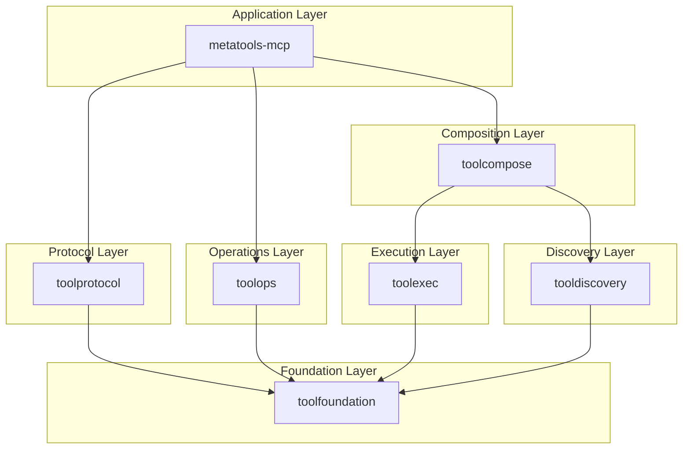

# PRD-182: Documentation Site

**Phase:** 8 - Integration
**Priority:** Medium
**Effort:** 6 hours
**Dependencies:** PRD-181
**Status:** Done (2026-02-01)

---

## Objective

Update MkDocs documentation site with consolidated repository structure.

---

## Tasks

### Task 1: Update mkdocs.yml

```yaml
site_name: ApertureStack
site_url: https://jonwraymond.github.io/ai-tools-stack/

nav:
  - Home: index.md
  - Getting Started:
    - Installation: getting-started/install.md
    - Quick Start: getting-started/quickstart.md
  - Foundation:
    - Overview: foundation/index.md
    - Model: foundation/model.md
    - Adapter: foundation/adapter.md
    - Version: foundation/version.md
  - Discovery:
    - Overview: discovery/index.md
    - Index: discovery/index-pkg.md
    - Search: discovery/search.md
    - Semantic: discovery/semantic.md
    - Docs: discovery/docs.md
  - Execution:
    - Overview: execution/index.md
    - Run: execution/run.md
    - Runtime: execution/runtime.md
    - Code: execution/code.md
    - Backend: execution/backend.md
  - Composition:
    - Overview: composition/index.md
    - Set: composition/set.md
    - Skill: composition/skill.md
  - Operations:
    - Overview: operations/index.md
    - Observe: operations/observe.md
    - Cache: operations/cache.md
    - Auth: operations/auth.md
    - Resilience: operations/resilience.md
    - Health: operations/health.md
  - Protocol:
    - Overview: protocol/index.md
    - Transport: protocol/transport.md
    - Wire: protocol/wire.md
    - MCP: protocol/mcp.md
    - A2A: protocol/a2a.md
  - API Reference:
    - metatools-mcp: api/metatools-mcp.md

theme:
  name: material
  features:
    - navigation.tabs
    - navigation.sections
    - search.suggest

plugins:
  - search
  - multirepo:
      repos:
        - name: toolfoundation
          import: github.com/jonwraymond/toolfoundation/docs
        - name: tooldiscovery
          import: github.com/jonwraymond/tooldiscovery/docs
        - name: toolexec
          import: github.com/jonwraymond/toolexec/docs
        - name: toolcompose
          import: github.com/jonwraymond/toolcompose/docs
        - name: toolops
          import: github.com/jonwraymond/toolops/docs
        - name: toolprotocol
          import: github.com/jonwraymond/toolprotocol/docs
```

### Task 2: Update Landing Page

```markdown
# ApertureStack

Build, discover, and execute AI agent tools with a unified ecosystem.

## Architecture



## Repositories

| Layer | Repository | Packages |
|-------|------------|----------|
| Foundation | toolfoundation | model, adapter, version |
| Discovery | tooldiscovery | index, search, semantic, docs |
| Execution | toolexec | run, runtime, code, backend |
| Composition | toolcompose | set, skill |
| Operations | toolops | observe, cache, auth, resilience, health |
| Protocol | toolprotocol | transport, wire, discover, content, task, stream, session, elicit, resource, prompt |

## Quick Start

```bash
# Install metatools-mcp
go install github.com/jonwraymond/metatools-mcp/cmd/metatools@latest

# Run MCP server
metatools serve

## Implementation Summary

- mkdocs nav and multirepo imports aligned with consolidated repos.
- D2 diagrams re-rendered and embedded into component docs.
- GitHub Pages publish flow uses mike for `latest`/`stable` versions.
```
```

### Task 3: Build and Deploy

```bash
# Build docs
mkdocs build

# Deploy to GitHub Pages
mkdocs gh-deploy
```

### Task 4: Commit

```bash
git add -A
git commit -m "docs: update for consolidated repositories

- Restructure navigation for 6 consolidated repos
- Update architecture diagrams
- Add multirepo imports
- Update landing page

Co-Authored-By: Claude Opus 4.5 <noreply@anthropic.com>"

git push origin main
```

---

## Next Steps

- PRD-190: Archive Old Repos
- Gate G6: Integration complete
