# User Journey

This journey shows the full end-to-end agent workflow via MCP metatools.

## End-to-end flow (agent view)

```mermaid
%%{init: {'theme': 'base', 'themeVariables': {'primaryColor': '#2b6cb0', 'primaryTextColor': '#fff'}}}%%
sequenceDiagram
    autonumber

    participant Agent as 🤖 AI Agent
    participant MCP as 🔷 metatools-mcp
    participant Index as 📇 toolindex
    participant Docs as 📚 tooldocs
    participant Run as ▶️ toolrun
    participant Code as 💻 toolcode

    rect rgb(43, 108, 176, 0.1)
        Note over Agent,Index: Phase 1: Discovery
        Agent->>+MCP: search_tools("create issue", 5)
        MCP->>+Index: Search(query, limit)
        Index-->>-MCP: Summary[]
        MCP-->>-Agent: summaries (no schemas)
    end

    rect rgb(214, 158, 46, 0.1)
        Note over Agent,Docs: Phase 2: Documentation
        Agent->>+MCP: describe_tool(id, "schema")
        MCP->>+Docs: DescribeTool(id, DetailSchema)
        Docs-->>-MCP: ToolDoc
        MCP-->>-Agent: tool schema + description
    end

    rect rgb(56, 161, 105, 0.1)
        Note over Agent,Run: Phase 3: Execution
        Agent->>+MCP: run_tool(id, args)
        MCP->>+Run: Run(ctx, id, args)
        Run-->>-MCP: RunResult
        MCP-->>-Agent: result
    end

    rect rgb(107, 70, 193, 0.1)
        Note over Agent,Code: Phase 4: Orchestration (optional)
        Agent->>+MCP: execute_code(snippet)
        MCP->>+Code: ExecuteCode(ctx, params)
        Code-->>-MCP: ExecuteResult
        MCP-->>-Agent: value + tool calls
    end
```




### MCP Tool Surface

```mermaid
%%{init: {'theme': 'base', 'themeVariables': {'primaryColor': '#2b6cb0'}}}%%
flowchart TB
    subgraph agent["AI Agent"]
        Request["📥 MCP Request<br/><small>JSON-RPC</small>"]
    end

    subgraph metatools["metatools-mcp"]
        direction TB

        subgraph discovery["Discovery Tools"]
            SearchTools["🔍 search_tools"]
            ListNS["📁 list_namespaces"]
        end

        subgraph docs["Documentation Tools"]
            DescribeTool["📚 describe_tool"]
            ListExamples["💡 list_tool_examples"]
        end

        subgraph execution["Execution Tools"]
            RunTool["▶️ run_tool"]
            RunChain["🔗 run_chain"]
        end

        subgraph orchestration["Orchestration (optional)"]
            ExecCode["💻 execute_code"]
        end
    end

    subgraph stack["Stack Libraries"]
        Index["📇 toolindex"]
        Docs2["📚 tooldocs"]
        Run["▶️ toolrun"]
        Code["💻 toolcode"]
    end

    Request --> SearchTools --> Index
    Request --> ListNS --> Index
    Request --> DescribeTool --> Docs2
    Request --> ListExamples --> Docs2
    Request --> RunTool --> Run
    Request --> RunChain --> Run
    Request --> ExecCode --> Code

    style agent fill:#4a5568,stroke:#2d3748
    style metatools fill:#2b6cb0,stroke:#2c5282,stroke-width:2px
    style discovery fill:#3182ce,stroke:#2c5282
    style docs fill:#d69e2e,stroke:#b7791f
    style execution fill:#38a169,stroke:#276749
    style orchestration fill:#6b46c1,stroke:#553c9a
    style stack fill:#718096,stroke:#4a5568
```



## Step-by-step

1. **Discover tools** with `search_tools` (summary-only results).
2. **Inspect schema** using `describe_tool` (schema or full detail).
3. **Execute** a single tool with `run_tool` or a sequence with `run_chain`.
4. **Orchestrate** complex flows using `execute_code` (optional).

## Example: full agent workflow

```text
1) search_tools("create issue", limit=5)
2) describe_tool("github:create_issue", detail_level="schema")
3) run_tool("github:create_issue", args={...})
4) run_chain([{tool_id:"github:get_issue"}, {tool_id:"github:add_label", use_previous:true}])
```

## Expected outcomes

- Stable MCP-compatible APIs for discovery, documentation, and execution.
- Consistent error objects for tool failures.
- Progressive disclosure to minimize token costs.

## Common failure modes

- Invalid input payloads (handler validation errors).
- Tool-level errors returned in `ErrorObject` with `code` and `op` fields.
- Unsupported options (e.g., `stream=true` for `run_tool`).
