# User Journey

This journey shows the full end-to-end agent workflow via MCP metatools.

## Transport selection

Before tool discovery begins, clients establish a connection via one of the
supported transports. The transport choice depends on the client environment:

```mermaid
%%{init: {'theme': 'base', 'themeVariables': {'primaryColor': '#2b6cb0'}}}%%
flowchart LR
    subgraph clients["Clients"]
        Claude["🖥️ Claude Desktop"]
        WebApp["🌐 Web Application"]
        CLI["⌨️ CLI Tool"]
    end

    subgraph transports["Transport Layer"]
        Stdio["📟 stdio<br/><small>stdin/stdout</small>"]
        Streamable["🔄 streamable<br/><small>HTTP POST/GET/DELETE</small>"]
        SSE["📡 sse<br/><small>deprecated</small>"]
    end

    subgraph server["metatools-mcp"]
        MCP["🔷 MCP Server"]
    end

    Claude --> Stdio --> MCP
    WebApp --> Streamable --> MCP
    CLI --> Stdio --> MCP
    WebApp -.-> SSE -.-> MCP

    style clients fill:#4a5568,stroke:#2d3748
    style transports fill:#805ad5,stroke:#6b46c1
    style server fill:#2b6cb0,stroke:#2c5282
    style SSE fill:#718096,stroke:#4a5568,stroke-dasharray: 5 5
```



| Transport | Client Type | Session | Protocol |
|-----------|------------|---------|----------|
| `stdio` | Local CLI, Claude Desktop | Implicit | stdin/stdout JSON-RPC |
| `streamable` | Web apps, remote clients | Mcp-Session-Id header | HTTP (MCP 2025-03-26) |
| `sse` | Legacy web clients | Cookie-based | HTTP + SSE (deprecated) |

**Streamable HTTP session flow:**
1. Client POSTs `initialize` request to `/mcp`
2. Server returns `Mcp-Session-Id` header
3. Client includes session ID in all subsequent requests
4. Client may open GET stream for server notifications
5. Client sends DELETE to terminate session

## End-to-end flow (agent view)


### MCP Tool Surface

```mermaid
%%{init: {'theme': 'base', 'themeVariables': {'primaryColor': '#2b6cb0'}}}%%
flowchart TB
    subgraph agent["AI Agent"]
        Request["📥 MCP Request<br/><small>JSON-RPC</small>"]
    end

    subgraph transport["Transport Layer"]
        Stdio["📟 stdio"]
        Streamable["🔄 streamable"]
    end

    subgraph metatools["metatools-mcp"]
        Server["🔷 MCP Server"]

        subgraph discovery["Discovery Tools"]
            SearchTools["🔍 search_tools"]
            ListNS["📁 list_namespaces"]
        end

        subgraph docs["Documentation Tools"]
            DescribeTool["📚 describe_tool"]
            ListExamples["💡 list_tool_examples"]
        end

        subgraph execution["Execution Tools"]
            RunTool["▶️ run_tool"]
            RunChain["🔗 run_chain"]
        end

        subgraph orchestration["Orchestration (optional)"]
            ExecCode["💻 execute_code"]
        end
    end

    subgraph stack["Stack Libraries"]
        Index["📇 toolindex"]
        Docs2["📚 tooldocs"]
        Run["▶️ toolrun"]
        Code["💻 toolcode"]
    end

    Request --> Stdio & Streamable --> Server
    Server --> SearchTools --> Index
    Server --> ListNS --> Index
    Server --> DescribeTool --> Docs2
    Server --> ListExamples --> Docs2
    Server --> RunTool --> Run
    Server --> RunChain --> Run
    Server --> ExecCode --> Code

    style agent fill:#4a5568,stroke:#2d3748
    style transport fill:#805ad5,stroke:#6b46c1
    style metatools fill:#2b6cb0,stroke:#2c5282,stroke-width:2px
    style discovery fill:#3182ce,stroke:#2c5282
    style docs fill:#d69e2e,stroke:#b7791f
    style execution fill:#38a169,stroke:#276749
    style orchestration fill:#6b46c1,stroke:#553c9a
    style stack fill:#718096,stroke:#4a5568
```



## Step-by-step

0. **Connect** via transport (stdio for local, streamable HTTP for remote).
1. **Discover tools** with `search_tools` (summary-only results).
2. **Inspect schema** using `describe_tool` (schema or full detail).
3. **Execute** a single tool with `run_tool` or a sequence with `run_chain`.
4. **Orchestrate** complex flows using `execute_code` (optional).

> When built with `-tags toolruntime`, `execute_code` runs in a sandboxed runtime.
> Default profile is `dev` (unsafe); set `METATOOLS_RUNTIME_PROFILE=standard`
> to enable Docker when available. Set `METATOOLS_WASM_ENABLED=true` and
> `METATOOLS_RUNTIME_BACKEND=wasm` to use the WASM backend instead.

## Example: full agent workflow

```text
1) search_tools("create issue", limit=5)
2) describe_tool("github:create_issue", detail_level="schema")
3) run_tool("github:create_issue", args={...})
4) run_chain([{tool_id:"github:get_issue"}, {tool_id:"github:add_label", use_previous:true}])
```

## Expected outcomes

- Stable MCP-compatible APIs for discovery, documentation, and execution.
- Consistent error objects for tool failures.
- Progressive disclosure to minimize token costs.

## Common failure modes

- Invalid input payloads (handler validation errors).
- Tool-level errors returned in `ErrorObject` with `code` and `op` fields.
- Unsupported options (e.g., `stream=true` for `run_tool`).
